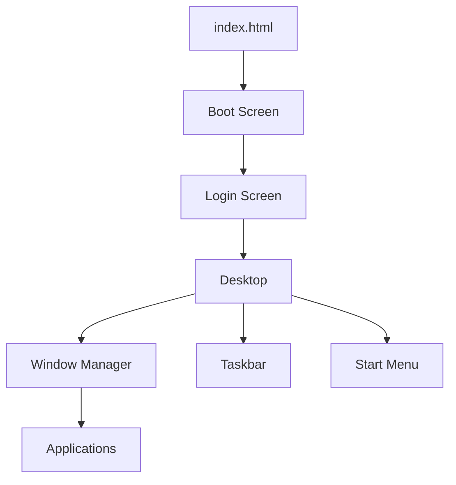
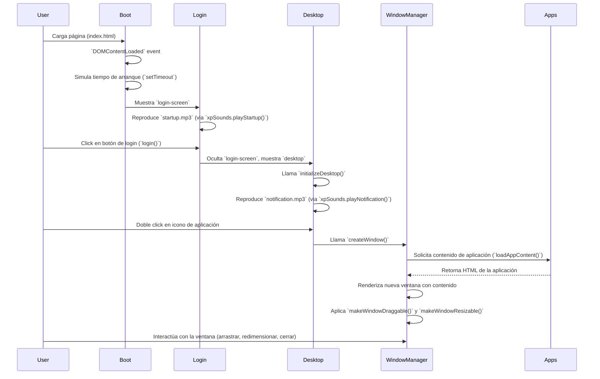

# Arquitectura del Proyecto ZarateXP

## 1. Visión General del Proyecto

ZarateXP es un portfolio interactivo que simula la interfaz de usuario de Windows XP, construido completamente desde cero utilizando HTML, CSS y JavaScript vanilla. El objetivo principal es ofrecer una experiencia de usuario única y nostálgica, presentando la información del desarrollador (Ivan Agustin Zarate) de una manera creativa y funcional, imitando el sistema operativo clásico.

**Objetivos del Portfolio:**
- Proporcionar una plataforma interactiva para mostrar habilidades y proyectos.
- Demostrar conocimientos en desarrollo frontend con tecnologías básicas.
- Ofrecer una experiencia de usuario distintiva y memorable.

**Tecnologías Utilizadas:**
- HTML5: Para la estructura y el contenido de la interfaz.
- CSS3: Para el diseño, la estilización y las animaciones, sin el uso de frameworks.
- JavaScript Vanilla: Para toda la lógica interactiva, la gestión de ventanas, el menú de inicio y las aplicaciones.
- Sin dependencias externas: El proyecto es completamente autónomo, lo que facilita su despliegue y mantenimiento.

## 2. Arquitectura del Sistema

El sistema ZarateXP se basa en una arquitectura modular y orientada a eventos, donde cada componente maneja una parte específica de la interfaz de usuario y su lógica asociada.



**Componentes Principales:**
- **index.html**: El archivo principal que carga la estructura base, los estilos y los scripts.
- **Boot Screen**: La pantalla inicial de carga con animación.
- **Login Screen**: La pantalla de inicio de sesión.
- **Desktop**: El área principal de trabajo con iconos y fondo.
- **Window Manager**: Gestiona la creación, arrastre, redimensionamiento, minimización, maximización y cierre de ventanas.
- **Taskbar**: La barra inferior con el botón de inicio, reloj y área de notificaciones.
- **Start Menu**: El menú desplegable que contiene accesos a aplicaciones y opciones del sistema.
- **Applications**: Contenido dinámico cargado en las ventanas, representando las secciones del portfolio (About Me, Projects, Skills, Contact, etc.).

**Flujo de Datos:**
La interacción se maneja principalmente a través de eventos del DOM. Los scripts de JavaScript escuchan eventos de usuario (clics, arrastres) y manipulan el DOM para reflejar los cambios en la interfaz. No hay una base de datos persistente; todo el estado es efímero y se gestiona en memoria del navegador.

## 3. Estructura de Archivos

El proyecto sigue una estructura de directorios clara y organizada para separar las responsabilidades:

```
ZarateXP/
├── index.html              # Archivo HTML principal
├── css/                    # Directorio para hojas de estilo
│   ├── boot.css            # Estilos para la pantalla de arranque
│   ├── desktop.css         # Estilos para el escritorio y sus elementos
│   ├── windows.css         # Estilos para las ventanas y sus controles
│   └── taskbar.css         # Estilos para la barra de tareas y el menú de inicio
├── js/                     # Directorio para scripts JavaScript
│   ├── apps.js             # Lógica y contenido de las aplicaciones del portfolio
│   ├── boot.js             # Lógica de la secuencia de arranque y login
│   ├── desktop.js          # Funcionalidad del escritorio (iconos, menú inicio)
│   ├── sounds.js           # Gestión de efectos de sonido
│   └── windows.js          # Lógica para el sistema de ventanas (arrastrar, redimensionar, etc.)
└── assets/                 # Recursos multimedia
    ├── images/             # Iconos, fondos y otras imágenes
    ├── sounds/             # Archivos de audio para efectos de sonido
    └── documents/          # Documentos como PDFs (ej. CV)
```

## 4. Componentes Principales

### Sistema de Boot
Gestionado por `js/boot.js` y `css/boot.css`. Simula la secuencia de inicio de Windows XP con una barra de progreso animada y el logo. Al finalizar, transiciona a la pantalla de login.

### Sistema de Login
También gestionado por `js/boot.js` y `css/boot.css`. Presenta una interfaz de login simplificada donde el usuario hace clic en su nombre para acceder al escritorio. Incluye un sonido de inicio de Windows XP.

### Desktop Manager
Implementado en `js/desktop.js` y `css/desktop.css`. Se encarga de:
- Renderizar los iconos del escritorio.
- Gestionar el menú de inicio y sus elementos.
- Actualizar el reloj en la barra de tareas.
- Manejar la interacción con los iconos (apertura de aplicaciones).

### Window Manager
Centralizado en `js/windows.js` y `css/windows.css`. Proporciona la funcionalidad para:
- **Arrastrar ventanas**: Permite mover las ventanas por el escritorio.
- **Redimensionar ventanas**: Ajustar el tamaño de las ventanas.
- **Minimizar/Maximizar/Cerrar**: Controles estándar de ventana.
- **Gestión de Z-index**: Asegura que la ventana activa esté siempre al frente.

### Sistema de Aplicaciones
Definido en `js/apps.js`. Contiene las funciones que generan el contenido HTML para cada "aplicación" del portfolio (ej. "About Me", "Projects"). Estas funciones son llamadas por el Window Manager cuando se abre una nueva ventana.

### Sistema de Sonidos
Gestionado por `js/sounds.js`. Proporciona una API simple para reproducir efectos de sonido (inicio, click, error, etc.) utilizando la API de Audio de JavaScript.

## 5. Flujo de Ejecución



## 6. Patrones de Diseño

- **Arquitectura Modular**: El código está dividido en archivos JavaScript y CSS separados, cada uno con una responsabilidad específica (boot, desktop, windows, apps, sounds). Esto mejora la mantenibilidad y la escalabilidad.
- **Programación Orientada a Eventos**: La interacción del usuario y la comunicación entre componentes se manejan a través de listeners de eventos del DOM, lo que permite un acoplamiento bajo entre las partes del sistema.
- **Separación de Responsabilidades (SoC)**: HTML para la estructura, CSS para la presentación y JavaScript para la lógica y el comportamiento. Esto facilita la comprensión y modificación del código.
- **Vanilla JavaScript**: La elección de JavaScript puro evita la sobrecarga de frameworks y librerías, resultando en un proyecto ligero y con un control total sobre el rendimiento.

## 7. Integración y Extensibilidad

El diseño del proyecto facilita la adición de nuevas funcionalidades y la personalización:

### Cómo Agregar Nuevas Aplicaciones
1.  **HTML**: Añadir un nuevo `div` con la clase `desktop-icon` y un atributo `data-app` único en `index.html` para el icono en el escritorio.
2.  **JavaScript**: En `js/apps.js`, crear una nueva función que retorne el contenido HTML de la aplicación. Luego, añadir un nuevo `case` en la función `loadAppContent()` para asociar el `data-app` con la nueva función de contenido.
3.  **CSS**: Si la aplicación requiere estilos específicos, agregarlos en `css/windows.css` o un nuevo archivo CSS si es complejo.

### Sistema de Personalización
- **Información Personal**: Se edita directamente `js/apps.js` para actualizar los datos de "About Me", "Projects", "Skills" y "Contact".
- **Colores/Tema**: Modificando las variables CSS en los archivos `.css` se puede cambiar fácilmente la apariencia visual del sistema.
- **Iconos**: Reemplazando los archivos de imagen en `assets/images/` (manteniendo los nombres) se pueden actualizar los iconos.

### Puntos de Extensión
- La estructura de `js/apps.js` permite añadir fácilmente nuevas "aplicaciones" o secciones del portfolio.
- El sistema de ventanas en `js/windows.js` es genérico y puede ser reutilizado para cualquier tipo de contenido.
- El sistema de sonidos en `js/sounds.js` es extensible para añadir más efectos de audio.

## 8. Decisiones de Diseño

La decisión de construir ZarateXP con HTML, CSS y JavaScript vanilla se tomó para:
- **Control Total**: Permite un control granular sobre cada aspecto de la interfaz y el rendimiento.
- **Rendimiento**: Evita la sobrecarga de frameworks, resultando en una aplicación web muy ligera y rápida.
- **Demostración de Habilidades Fundamentales**: Muestra una comprensión profunda de las tecnologías web básicas.
- **Independencia**: No hay dependencias externas, lo que simplifica el despliegue y reduce la superficie de ataque.

## 9. Futuras Mejoras

El proyecto tiene un roadmap claro para futuras mejoras, incluyendo:
- Implementación de la funcionalidad de la Papelera de Reciclaje.
- Adición de más efectos de sonido auténticos de Windows XP.
- Mejoras en las animaciones de ventanas (minimizar/maximizar).
- Desarrollo de aplicaciones adicionales como Calculadora, Paint o Buscaminas.
- Posible implementación de un sistema de archivos simulado y guardado de estado en `localStorage`.